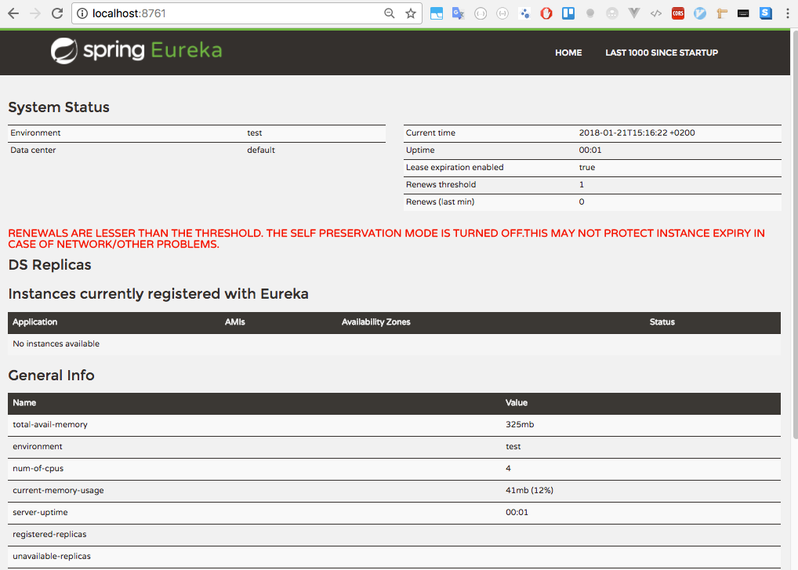
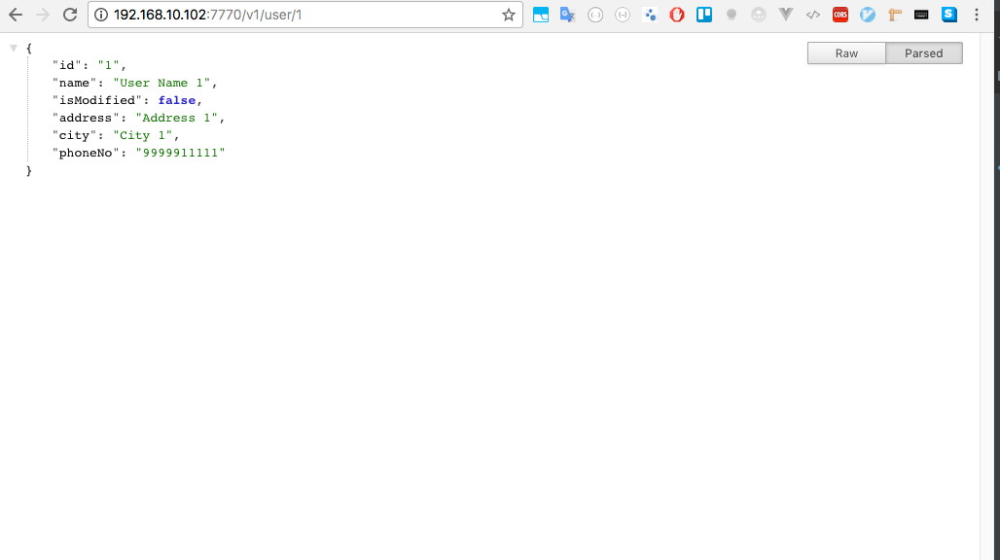
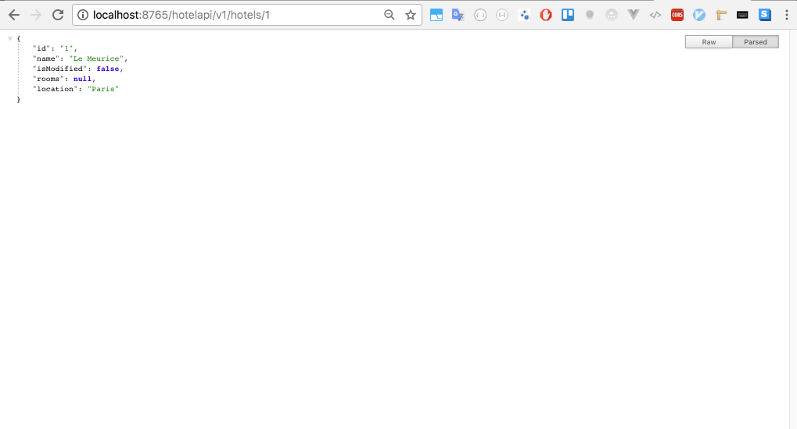
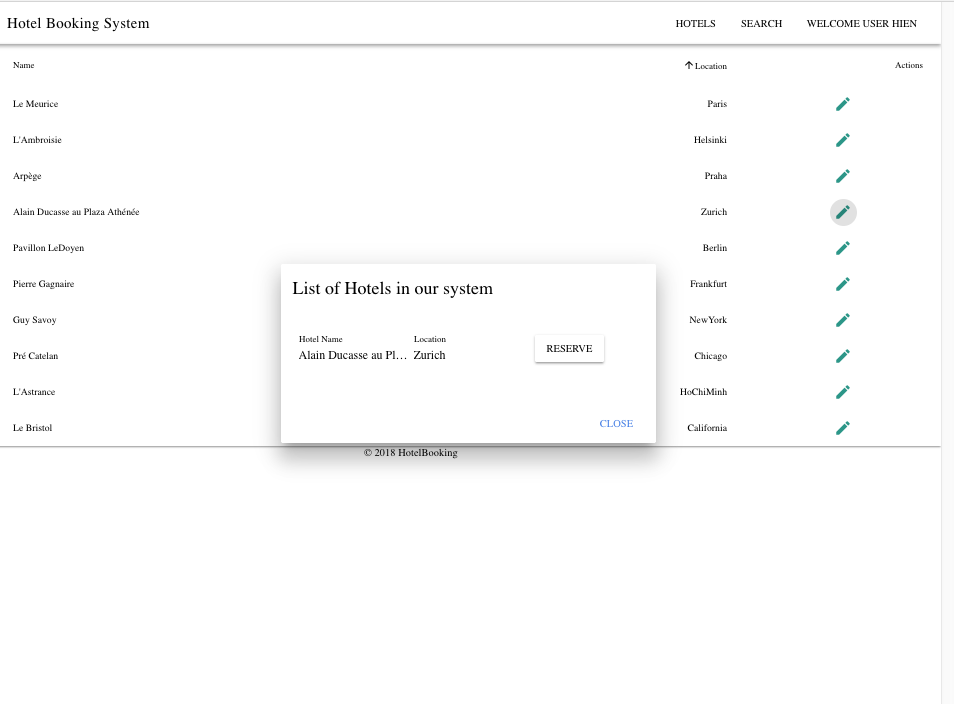
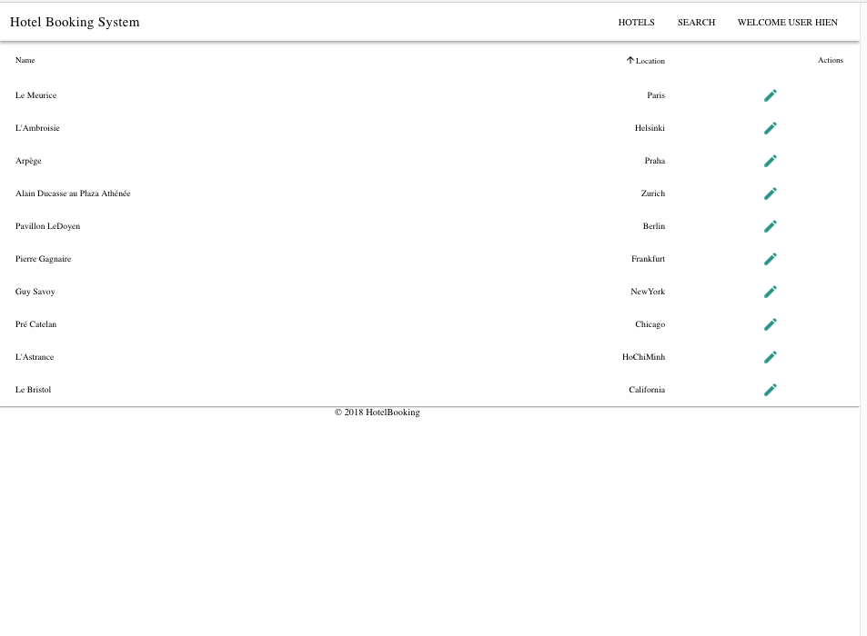
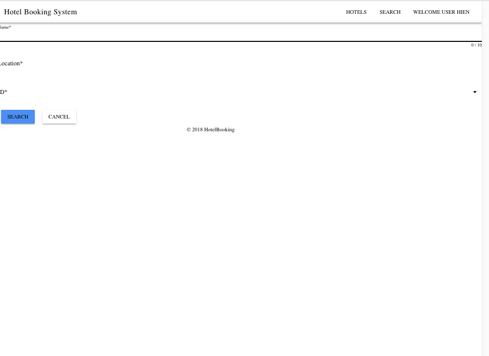
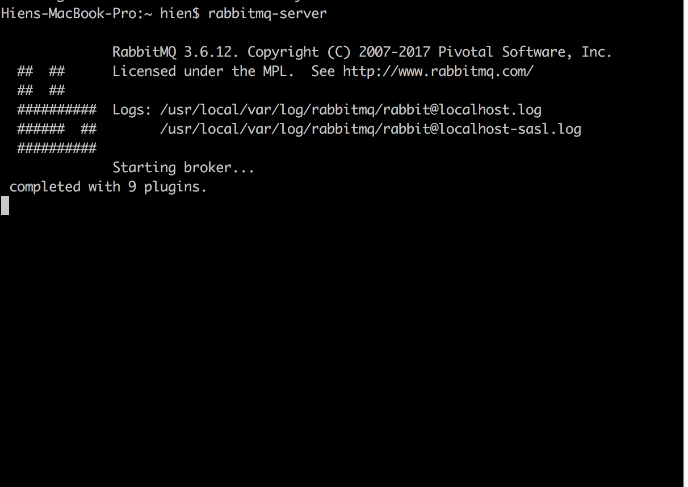

# HotelBooking
Hotel Booking project

### Tech stack 
+ Microservice with Java Spring boot
+ Service discovery and registration: Netflix Eureka
+ Edge/proxy server: Zuul
    + Client : RestTemplate, FeignClient, Eureka
+ Load balancing: Ribbon
+ Circuit breaker : Hystrix
    + Restaurant
    + User 
    + Booking 
+ Monitoring dashboard: Nexflix Turbine
    + User Turbine with Hystrix: http://localhost:8989/turbine.stream
    + You should start RabbitMQ server
    + Set up Hystrix dashboard 
    + Create Turbine service

+ Container
    + Docker
    + Install with docker 
        + docker-machine rm default
        + docker-machine create -d virtualbox --virtualbox-memory 4096 default
    + Building Docker images with Maven :   
        + User Docker Maven plugin 
        + Configure properties: 
            + Spring profile : Docker 
            + Port 
            + IP address set: true with Eureka(preferIp)
            + User Eureka server hostname 
            + Run : `mvn -P docker clean package`
            + Config Docker Maven plugin 
            + Create Dockerfile 
            + Config docker-assembly.xml 
            + Build Docker image : `mvn docker:build`
            + Build Docker image : `docker run -it -p 8080:8080 sourabhh/restaurant-service:PACKT-SNAPSHOT`
            + Run Docker using Maven: 
                + Add Configuration in pom.xml
                + Run : `mvc docker:start`
            + Integration testing with Docker 
                + Use plugin: Failsafe
                + Config Failsafe: pass service URL in service.url tag to perform integration testing 
                + User DockerIntegrationTest marker to mark our Docker integration test 
                + Command to perform integration testing using Maven: `mvn integration-test`

            + Push the image to Docker hub 
                + Add tags under docker-maven plugin 
                + Run `mvn -Ddocker.username=<username> -Ddocker.password=<password> deploy`
            + Manage Docker container 
                + Before start : 
                    + Set up Docker local registry 
                    + Build docker local registry : `docker run -d -p 5000:5000 --restart=always --name registry registry:2`
                    + Push , pull commands for local images : `docker push localhost:5000/sourabhh/restaurant-service:PACKT- SNAPSHOT`,`docker-compose pull`
                    + Execute docker-compose : `docker-compose up -d`
                + Use Docker compose : manage docker containers
                + Docker compose : number of containers, docker image, port, link 
                + Create docker-compose.yml 
                + Start all Docker containers with single command: `docker-compose up -d `
                + List all Docker containers starting : `docker-compose ps`
                + Check Docker images logs : `docker-compose logs`

+ Reactive microservice 
    + Apache Kafka, Apache Avro 
    + Implement reactive microservice 
    + Produce an event and Consume an event 

    + Apache Avro 
        + Create avro schema 
        + Use avro-maven-plugin (add avro-maven plugin in pom.xml)
        + Run `mvn package` to create BookingOrder.java class 
    + Apache Kafka stream : 
        + Message channel 
        + Add message converter bean 
        + Config kafka server 

        
    + Ensure Kafka and Zookeeper are running in host and port defined in application.yaml
    + Test the Producer 
    + Run the project and Post a new booking
    + It will produce Kafka topic(event) as shown from the logs 
    + Check Kafka console : message that confirm the message is received by Kafka
    + Consume the event 
    + Add avro schema
    + Config message channel(input)
    + Config kafka topic : bookingOrderInput 
    + config kafka server in consumer
    + Add event listener : @StreamListener

+ Secure microservice 
    + Enable SSL 
        + Set up SSL on Edge server : use Java keytool to generate keystore 
        + keytool -genkey -keyalg RSA -alias selfsigned -keystore keystore.jks -ext san=dns:localhost -storepass password -validity 365 -keysize 2048
        + keytool -importcert -file path/to/.crt -alias <cert alias> -  keystore <JRE/JAVA_HOME>/jre/lib/security/cacerts -storepass changeit
        + update application.yaml with ssl config 
        + re build the zuul server with https
        + Go to : localhost:8765/hotelapi/v1/hotels/1 ( the same with localhost:3401/v1/hotels/1)

+ Logging and ELK stack (centralize logging)
    + Docker compose logs : commands 
    + Elasticsearch, Logstash, Kibana ELK stack : log aggregation 
    + ELK stack set up : 
        + Download and install on localhost machine 
        + Install Elastic search 
            + Use ES docker image: docker pull docker.elastic.co/elasticsearch/elasticsearch:5.5.1 
            + http://localhost:9200/
            + Install GUI : plugin -install mobz/elasticsearch-head
            + Run Docker image : `docker-compose` for later to run ELK stack together 
            + Access GUI : http://localhost:9200/_plugin/head/. 
        + Install Logstash 
            + Use docker image:docker pull docker.elastic.co/logstash/logstash:5.5.1 
            + Config logstash : 
            input { 
            ### OTRS ### 
            file { 
                path => "\logs\otrs-service.log" 
                type => "otrs-api" 
                codec => "json" 
                start_position => "beginning" 
            } 
            
            ### edge ### 
            file { 
                path => "/logs/edge-server.log" 
                type => "edge-server" 
                codec => "json" 
            } 
            } 
            
            output { 
            stdout { 
                codec => rubydebug 
            } 
            elasticsearch { 
                hosts => "localhost:9200" 
            } 
            } 
            + Go to logstash home, run : bin/logstash agent -f logstash.conf 

        + Install Kibana: docker pull docker.elastic.co/kibana/kibana:5.5.1 
            + config : open config/kibana.yml : point elasticsearch.url 
            elasticsearch.url:http://localhost:9200
            + go tp kibana home : run : bin/kibana agent -f logstash.conf 
            + Or run docker image 
            + Access : http://localhost:5601/.
        + Install ELK stack from Docker : willdurand/elk
            + Run ELK stack using Docker compose : docker-compose-elk.yml
            + docker-compose -f docker-compose-elk.yml up -d 
            + Restart Logstash container after copy the pipeline CONF file pipeline/logstash.conf : 
            input { 
            tcp { 
                port => 5001 
                codec => "json" 
            } 
            } 
            
            output { 
            elasticsearch { 
                hosts => "elasticsearch:9200" 
            } 
            } 
        + Push logs to the ELK stack 

        + Use Zipkin and Sleuth for tracking 
            + Trace ID 
        + Add Zipkin and Sleuth dependencies
        + Go to : http://<zipkin host name>:9411/zipkin/  (zipkin dashboard)
        + 

+ Document API 
+ Versioning API 

### Run the project 
+ mvn clean install 
+ eureka server, turbine server, dashboard server , restaurant service, user service, booking service, api-service 
+ Eureka server : `http://localhost:8761/`
+ User API : `http://user-service/v1/users`
+ Hotel API : `http://hotel-service/v1/users`
+ Turbine Server : `http://localhost:8989/`
+ Dashboard Server: `http://localhost:7979`

### Tech stack 
+ Maven 
+ Spring cloud 
+ RabbitMQ 
+ Eureka 
+ Docker 
+ Apache Kafka
+ Apache Avro
+ ElasticSearch 
+ Logstash
+ Kibana

## Screen shot 
+ 

+ Eureka server 

+ RabbitMQ server start
 
 
 
 

+ Hystrix Dashboard 

